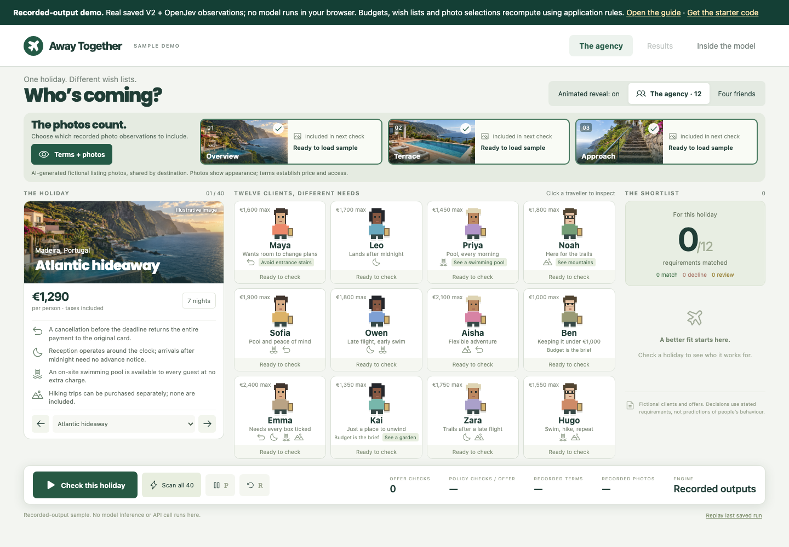

<div align="center">

# Build your own Jev-style specialist

**A free, runnable starting point from Mark Kashef and Early AI Adopters.**

Turn a document into a small, useful decision. See how it works, then train your own.

[Try the demo](https://build-your-own-jev.markkashef.chatgpt.site/demo/) · [Follow the visual guide](https://build-your-own-jev.markkashef.chatgpt.site) · [Copy the full prompt](prompts/TRAIN-MY-SPECIALIST.md)

</div>



A hotel offers “flexible cancellation.” Does that mean **cash back**, **hotel credit**, or **not enough information**?

That is the kind of small decision this project teaches you to build. The example is a fictional travel agency: AI reads the holiday’s terms and photos; code checks those observations against each traveller’s budget and wish list. You can adapt the workflow to your own documents and labels.

## Your first win: change one photo

**[Open the sample agency →](https://build-your-own-jev.markkashef.chatgpt.site/demo/)** No account, API key or model download required.

1. Select **The flexible escape · 2** from the holiday picker.
2. Leave all three photos included and click **Check this holiday**. Open Maya’s result: the stairs photo makes her decline.
3. Return to the agency, exclude the **Approach** photo, and check again. Maya now **needs review**.

Why review? Removing a photo does not prove a step-free route. This is the useful part of the example: the application preserves uncertainty instead of turning missing evidence into a yes.

> **What runs in the browser:** recorded model observations for 40 fictional holidays and nine photos, plus interactive application rules. Changing budgets, preferences and photo selections really changes the calculation. The hosted demo does not run a model or analyze new text or images.

## Choose your next step

| You want to… | Start here | You will get… |
|---|---|---|
| Understand the workflow | [Plain-English guide](docs/COMMUNITY-GUIDE.md) | The decisions behind examples, training and fair testing |
| Build with Claude or another coding assistant | [Complete specialist prompt](prompts/TRAIN-MY-SPECIALIST.md) | An editable brief with checkpoints and expected outputs |
| Run and modify the interface | [Run the sample app](#run-the-sample-app) | The persona UI running on your computer |
| Train a small model | [Run your first training experiment](#run-your-first-training-experiment) | A baseline, saved checkpoint and comparison report |

## Run the sample app

Requires **Git, Node 22+ and npm**. No Python or model setup is needed for this path.

```bash
git clone https://github.com/earlyaidopters/away-together-starter.git
cd away-together-starter/apps/public-demo
npm ci
npm run dev
```

Open the local URL printed by Vite. You should see **“Who’s coming?”**, the holiday picker and twelve traveller cards. The **Recorded-output demo** banner is intentional.

To check a UI change, run `npm test` and `npm run build` from `apps/public-demo`.

## Run your first training experiment

This path trains a **separate educational ModernBERT classifier**. It does not reproduce the video’s DeBERTa V2 model or its score.

You need **Python 3.12 and uv**, storage for the base-model download and checkpoint, and enough memory for the model. The tutorial selects Apple MPS, CUDA or CPU when available. Runtime varies by machine; there is no fixed completion-time promise.

From the **repository root**, install the pinned environment:

```bash
cd apps/agency
uv sync --frozen
cd ../..
```

Then run the smallest complete loop:

```bash
uv run --project apps/agency python tools/tutorial.py prepare --run workshops/first-check
uv run --project apps/agency python tools/tutorial.py download
uv run --project apps/agency python tools/tutorial.py baseline --run workshops/first-check --limit 8
uv run --project apps/agency python tools/tutorial.py train --run workshops/first-check --limit 8 --epochs 1
uv run --project apps/agency python tools/tutorial.py test --run workshops/first-check --limit 8
```

| Checkpoint | Look for this in `workshops/first-check/` |
|---|---|
| Prepared examples | `data/` and `data-manifest.json` |
| Original-model measurement | `baseline.json` |
| Trained model | `checkpoint/model.safetensors` and `training.json` |
| Frozen model and data identity | `freeze.json` |
| Original versus trained test results | `test.json`, including individual predictions |

**Success means those artifacts exist and the pipeline ran.** Eight decisions are a smoke check, not evidence of useful accuracy. The included 24 train / 12 development / 12 test scenarios are synthetic examples. A useful specialist needs substantially better evidence for its intended job.

The recipe preserves earlier runs and refuses to overwrite an opened final test. For another experiment, choose a new workshop name. [Predict a new input and expand the experiment →](docs/STEP-BY-STEP.md)

<details>
<summary><strong>Prefer to hand the setup to your coding assistant?</strong></summary>

```text
Set up https://github.com/earlyaidopters/away-together-starter locally.
Read the README first and check my prerequisites.
Start with the recorded sample app and show me that it works.
Then explain the model download and hardware needs before training.
Run the eight-decision baseline/train/test smoke check in a new workshop.
Show me the saved checkpoint and test report. Do not call its score a benchmark.
Do not overwrite an earlier run or make paid API calls.
```

Use an assistant with terminal and local-file access. Ask it to show the actual outputs, not just describe what should happen.

</details>

## Adapt the idea to your work

Start with **one input, one question and three precise answers**. For example:

| Your input | Your question | Possible answers |
|---|---|---|
| A cancellation clause | Is a cash refund available? | Yes / No / Can’t tell |
| A support message | Who should review it? | Billing / Technical support / Manual review |
| A policy paragraph | Does it explicitly allow this action? | Allowed / Prohibited / Not specified |

These are task ideas, not additional trained models included in the starter.

Check the label rules yourself. Keep related documents together when splitting data. Measure the original model before training. Choose a checkpoint using development results, freeze it, then open the final test. Keep the mistakes even when the model loses.

[Use the complete prompt](prompts/TRAIN-MY-SPECIALIST.md) to turn those decisions into a build brief.

## Where to look in the code

| Location | What you can change or inspect |
|---|---|
| [`apps/public-demo/src/`](apps/public-demo/src) | Travellers, interface and browser decision rules |
| [`apps/public-demo/public/sample-data/`](apps/public-demo/public/sample-data) | Recorded observations used by the demo |
| [`tools/tutorial.py`](tools/tutorial.py) | Prepare, baseline, train, test and predict stages |
| [`apps/agency/data/`](apps/agency/data) | Small train, development and test examples |
| [`apps/agency/travel_lab/nli.py`](apps/agency/travel_lab/nli.py) | Pinned starting model and candidate scoring |
| [`site/`](site) | Public visual-guide source |

The `apps/agency` folder in this starter supports the training recipe. It does **not** contain the full local agency server or V2 checkpoint.

## If something fails

| Symptom | Next step |
|---|---|
| `uv`, `node` or `npm` is missing | Install that prerequisite, reopen your terminal and retry. |
| The workshop already exists | Inspect its outputs or use a new name. Do not delete a result to bypass the guard. |
| The model download or training fails | Check disk space, connectivity and available memory. Use the saved error when asking for help. |
| The test refuses changed data or weights | Start a new experiment; the frozen run is deliberately protected. |
| The demo won’t read your own text or photo | Expected. It is a recorded sample; the training recipe is the path to your own text model. |

## Continue with the complete project

| Free starter, here | Complete community edition |
|---|---|
| Visual guide, full prompt and sample app | Full local agency with fresh inference |
| Small synthetic dataset and training recipe | Complete training pipeline and experiments |
| Your own new workshop | Saved V2 checkpoint and evaluation receipts |
| Independent exploration | Exclusive training and community support |

The video’s full experiment reached **95.28%** reference agreement versus **98.61%** for Jev on the same synthetic travel test. It did not beat Jev. Those are separate results from this starter’s training exercise.

**Build your own version with us.** Get the complete project code, training pipeline, model checkpoints, and exclusive training inside **[Early AI Adopters](https://www.skool.com/earlyaidopters/about)**.

---

Created by **Mark Kashef**. Original code is [MIT](LICENSE); upstream models, fonts and dependencies retain their [own terms](THIRD-PARTY-NOTICES.md). This independent project is not an official Jev implementation. [Contributions welcome](CONTRIBUTING.md).
